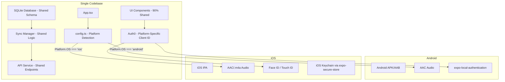
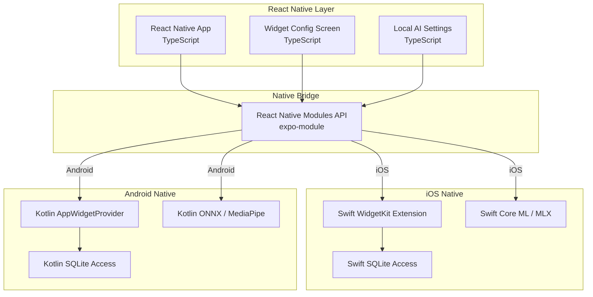
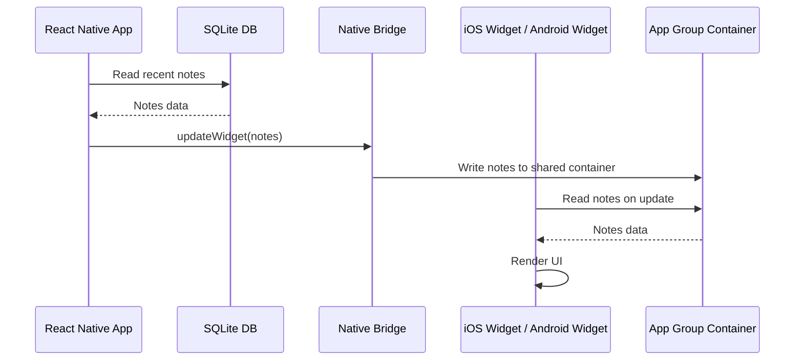

# NoteWave Cross-Platform Mobile App - Unified Build Recipe

## Overview

This document provides a complete, unified build recipe for creating a **single React Native + Expo codebase** that compiles to both Android and iOS NoteWave apps with full offline support. This is the **recommended approach** - 90%+ shared code with platform-specific configurations.

## Why Single Codebase?

| Factor | Benefit |
|--------|---------|
| **Shared Business Logic** | Sync manager, API layer, database schema - written once |
| **Shared UI Components** | Note cards, waveform visualizer, chat bubbles - written once |
| **Shared Types** | TypeScript types from web - copied once |
| **Platform-Specific Only** | Auth0 Client ID, audio format, biometrics, storage paths |
| **Single Build Command** | `eas build --platform all` builds both platforms |
| **Faster Iteration** | One codebase to maintain, test, and deploy |

## Architecture Overview



## Step 1: Initialize Single Expo Project

```bash
npx create-expo-app notewave-mobile --template
cd notewave-mobile
```

## Step 2: Install All Dependencies

```bash
# Core
npx expo install react-native-screens react-native-safe-area-context

# Navigation
npm install @react-navigation/native @react-navigation/bottom-tabs @react-navigation/native-stack
npx expo install react-native-gesture-handler react-native-reanimated

# Auth0
npm install auth0-react-native-context

# Audio Recording
npx expo install expo-av expo-file-system expo-media-library

# Storage
npm install @react-native-async-storage/async-storage

# Offline Local Database
npx expo install expo-sqlite

# Network Monitoring
npm install @react-native-community/netinfo

# Background Sync
npx expo install expo-task-manager expo-background-fetch

# UI
npm install lucide-react-native react-native-reanimated
npx expo install expo-font

# Networking
npm install axios

# Icons + Splash
npx expo install expo-font expo-splash-screen expo-status-bar

# iOS Specific
npx expo install expo-secure-store expo-local-authentication expo-haptics

# Markdown Rendering
npm install react-native-render-markdown
```

## Step 3: Configure app.json for Both Platforms

```json
{
  "expo": {
    "name": "NoteWave",
    "slug": "notewave",
    "version": "1.0.0",
    "orientation": "portrait",
    "icon": "./assets/icon.png",
    "userInterfaceStyle": "light",
    "splash": {
      "image": "./assets/splash.png",
      "resizeMode": "contain",
      "backgroundColor": "#F2F2F7"
    },
    "ios": {
      "supportsTablet": false,
      "bundleIdentifier": "com.notewave.app",
      "infoPlist": {
        "NSMicrophoneUsageDescription": "NoteWave needs access to your microphone to record voice notes for AI transcription.",
        "NSFaceIDUsageDescription": "NoteWave uses Face ID to secure your personal notes and settings.",
        "CFBundleURLTypes": [
          {
            "CFBundleURLSchemes": ["com.notewave.app"]
          }
        ],
        "UIViewControllerBasedStatusBarAppearance": false,
        "UIBackgroundModes": ["audio"]
      },
      "associatedDomains": [
        "applinks:ccma-fetch.space"
      ]
    },
    "android": {
      "adaptiveIcon": {
        "foregroundImage": "./assets/adaptive-icon.png",
        "backgroundColor": "#F2F2F7"
      },
      "package": "com.notewave.app",
      "intentFilters": [
        {
          "host": "com.notewave.app.callback",
          "scheme": "com.notewave.app"
        }
      ]
    },
    "web": {
      "favicon": "./assets/favicon.png"
    },
    "extra": {
      "eas": {
        "projectId": "your-eas-project-id"
      }
    }
  }
}
```

## Step 4: Create Platform-Aware Configuration

Create `src/config.ts`:

```typescript
import { Platform } from 'react-native';

// API Configuration
export const API_BASE_URL = "https://napi.ccma-fetch.space";

export function apiUrl(path: string): string {
  return `${API_BASE_URL}${path}`;
}

// Auth0 Configuration - Platform-Specific Client IDs
const ANDROID_CLIENT_ID = "MEnHjqTVml8sN8oF6yOLq7NmsO8ua7nn";
const IOS_CLIENT_ID = "sI7yyDSnu5Jrzab6JcXkJzj5zB7YgbVX";

export const AUTH0_CONFIG = {
  domain: "notewave.eu.auth0.com",
  clientId: Platform.OS === 'ios' ? IOS_CLIENT_ID : ANDROID_CLIENT_ID,
  redirectUri: "com.notewave.app://com.notewave.app/callback",
  scope: "openid profile email",
};

// Audio Configuration - Platform-Specific Formats
export const AUDIO_CONFIG = {
  sampleRate: 44100,
  channels: 1,
  bitsPerSecond: 32000,
  format: Platform.OS === 'ios'
    ? 'aac'
    : 'default',
  maxDurationSeconds: 300,
};

// Storage Configuration
export const STORAGE_CONFIG = {
  maxLocalAudioMB: 500,
  maxDatabaseMB: 100,
  db_name: 'notewave.db',
};
```

## Step 5: Set Up Auth0 Authentication

Create `src/auth/AuthProvider.tsx`:

```typescript
import React from 'react';
import { Auth0Provider } from 'auth0-react-native-context';
import { AUTH0_CONFIG } from '../config';
import AsyncStorage from '@react-native-async-storage/async-storage';

class CustomStorage implements Storage {
  async getItem(key: string): Promise<string | null> {
    return AsyncStorage.getItem(key);
  }
  async setItem(key: string, value: string): Promise<void> {
    await AsyncStorage.setItem(key, value);
  }
  async removeItem(key: string): Promise<void> {
    await AsyncStorage.removeItem(key);
  }
}

export function AuthProviderWrapper({ children }: { children: React.ReactNode }) {
  return (
    <Auth0Provider
      domain={AUTH0_CONFIG.domain}
      clientId={AUTH0_CONFIG.clientId}
      redirectUri={AUTH0_CONFIG.redirectUri}
      scope={AUTH0_CONFIG.scope}
      cacheStorage={new CustomStorage()}
    >
      {children}
    </Auth0Provider>
  );
}
```

Create `src/auth/authToken.ts`:

```typescript
import { useAuth0 } from 'auth0-react-native-context';

let cachedToken: string | null = null;
let tokenExpiry: number = 0;

export async function getAccessToken(): Promise<string | null> {
  // Return cached token if still valid
  if (cachedToken && Date.now() < tokenExpiry - 60000) {
    return cachedToken;
  }
  // In production, use the Auth0 client directly outside React context
  // This is a placeholder - the actual implementation depends on your Auth0 setup
  return cachedToken;
}

export function cacheToken(token: string, expiresIn: number) {
  cachedToken = token;
  tokenExpiry = Date.now() + (expiresIn * 1000);
}
```

## Step 6: Initialize SQLite Database

Create `src/database/initialize.ts`:

```typescript
import * as SQLite from 'expo-sqlite';
import { STORAGE_CONFIG } from '../config';

export async function initializeDatabase(): Promise<SQLite.SQLiteDatabase> {
  const db = SQLite.openDatabaseSync(STORAGE_CONFIG.db_name);

  db.execSync(`
    CREATE TABLE IF NOT EXISTS notes (
      id TEXT PRIMARY KEY,
      userId TEXT NOT NULL,
      title TEXT NOT NULL,
      transcript TEXT DEFAULT '',
      ideaSummary TEXT DEFAULT '',
      actionItems TEXT DEFAULT '',
      category TEXT DEFAULT 'ideas',
      ideaName TEXT,
      scheduledDate TEXT,
      projectStartDate TEXT,
      isComplex INTEGER DEFAULT 0,
      subTodos TEXT DEFAULT '[]',
      tags TEXT DEFAULT '[]',
      modelUsed TEXT,
      duration INTEGER DEFAULT 0,
      audioKey TEXT,
      audioBytes INTEGER DEFAULT 0,
      audioLocalPath TEXT,
      createdAt TEXT NOT NULL,
      updatedAt TEXT NOT NULL,
      syncStatus TEXT DEFAULT 'synced',
      serverVersion INTEGER DEFAULT 0,
      localVersion INTEGER DEFAULT 1,
      cloudSyncEnabled INTEGER DEFAULT 1
    );

    CREATE TABLE IF NOT EXISTS sync_queue (
      id TEXT PRIMARY KEY,
      noteId TEXT NOT NULL,
      operation TEXT NOT NULL,
      payload TEXT NOT NULL,
      createdAt TEXT NOT NULL,
      retryCount INTEGER DEFAULT 0,
      status TEXT DEFAULT 'pending',
      error TEXT
    );

    CREATE TABLE IF NOT EXISTS user_settings (
      key TEXT PRIMARY KEY,
      value TEXT NOT NULL
    );

    CREATE TABLE IF NOT EXISTS tasks (
      id TEXT PRIMARY KEY,
      noteId TEXT,
      text TEXT NOT NULL,
      completed INTEGER DEFAULT 0,
      createdAt TEXT NOT NULL,
      updatedAt TEXT NOT NULL,
      syncStatus TEXT DEFAULT 'synced',
      serverVersion INTEGER DEFAULT 0
    );

    CREATE INDEX IF NOT EXISTS idx_notes_sync_status ON notes(syncStatus);
    CREATE INDEX IF NOT EXISTS idx_notes_user ON notes(userId);
    CREATE INDEX IF NOT EXISTS idx_queue_status ON sync_queue(status);
  `);

  // Default settings
  db.execSync(`INSERT OR IGNORE INTO user_settings (key, value) VALUES
    ('cloudSyncEnabled', 'true'),
    ('autoSyncEnabled', 'true'),
    ('syncWifiOnly', 'false'),
    ('deleteLocalAfterSync', 'false'),
    ('offlineMode', 'false')
  `);

  return db;
}
```

## Step 7: Create Sync Manager Service

Create `src/services/syncManager.ts`:

```typescript
import * as SQLite from 'expo-sqlite';
import NetInfo from '@react-native-community/netinfo';
import { apiUrl } from '../config';
import { getAccessToken } from '../auth/authToken';

export type SyncStatus = 'synced' | 'pending' | 'conflict' | 'local_only' | 'offline';

export class SyncManager {
  private db: SQLite.SQLiteDatabase | null = null;
  private netInfoSubscription: any = null;
  private isOnline = false;
  private syncInProgress = false;

  async initialize(db: SQLite.SQLiteDatabase) {
    this.db = db;
    this.startNetworkMonitor();
  }

  private startNetworkMonitor() {
    this.netInfoSubscription = NetInfo.addEventListener(async (state) => {
      const wasOnline = this.isOnline;
      this.isOnline = !!(state.isConnected && state.isInternetReachable);

      if (!wasOnline && this.isOnline) {
        console.log('[SyncManager] Network restored, triggering sync...');
        await this.fullSync();
      }
    });
  }

  async fullSync(): Promise<{ success: boolean; notesSynced: number; conflicts: number }> {
    if (!this.db || !this.isOnline || this.syncInProgress) {
      return { success: false, notesSynced: 0, conflicts: 0 };
    }

    const syncEnabled = await this.getSetting('cloudSyncEnabled', 'true');
    if (syncEnabled !== 'true') {
      return { success: true, notesSynced: 0, conflicts: 0 };
    }

    this.syncInProgress = true;
    const result = { success: true, notesSynced: 0, conflicts: 0 };

    try {
      const pushResult = await this.pushSync();
      result.notesSynced += pushResult.synced;
      result.conflicts += pushResult.conflicts;

      const pullResult = await this.pullSync();
      result.notesSynced += pullResult.synced;
      result.conflicts += pullResult.conflicts;
    } catch (error) {
      console.error('[SyncManager] Sync failed:', error);
      result.success = false;
    } finally {
      this.syncInProgress = false;
    }

    return result;
  }

  private async pushSync(): Promise<{ synced: number; conflicts: number }> {
    if (!this.db) return { synced: 0, conflicts: 0 };

    const pendingNotes = this.db.getAllAsync(
      'SELECT * FROM notes WHERE syncStatus = ? AND cloudSyncEnabled = ?',
      ['pending', 1]
    );

    if (!pendingNotes || pendingNotes.length === 0) {
      return { synced: 0, conflicts: 0 };
    }

    const token = await getAccessToken();
    const synced = { synced: 0, conflicts: 0 };

    for (const note of pendingNotes) {
      try {
        const response = await fetch(apiUrl('/api/notes/sync'), {
          method: 'POST',
          headers: {
            'Content-Type': 'application/json',
            Authorization: `Bearer ${token}`,
          },
          body: JSON.stringify({ notes: [note] }),
        });

        if (response.ok) {
          this.db.runAsync(
            'UPDATE notes SET syncStatus = ?, serverVersion = serverVersion + 1 WHERE id = ?',
            ['synced', note.id]
          );
          synced.synced++;
        } else {
          const data = await response.json();
          if (data.error === 'CONFLICT') {
            this.db.runAsync(
              'UPDATE notes SET syncStatus = ?, localVersion = ? WHERE id = ?',
              ['conflict', note.serverVersion, note.id]
            );
            synced.conflicts++;
          }
        }
      } catch (error) {
        console.error(`[SyncManager] Failed to sync note ${note.id}:`, error);
      }
    }

    return synced;
  }

  private async pullSync(): Promise<{ synced: number; conflicts: number }> {
    if (!this.db) return { synced: 0, conflicts: 0 };

    const token = await getAccessToken();
    const response = await fetch(apiUrl('/api/notes'), {
      headers: { Authorization: `Bearer ${token}` },
    });

    if (!response.ok) return { synced: 0, conflicts: 0 };

    const data = await response.json();
    const remoteNotes = data.notes || [];
    let synced = 0;

    for (const remoteNote of remoteNotes) {
      const localNote = this.db.getFirstSync(
        'SELECT * FROM notes WHERE id = ?',
        [remoteNote.id]
      );

      if (!localNote) {
        this.insertNote(remoteNote);
        synced++;
      } else if (remoteNote.serverVersion > localNote.localVersion) {
        this.updateNoteFromServer(remoteNote);
        synced++;
      }
    }

    return { synced, conflicts: 0 };
  }

  async queueNoteChange(note: any, operation: 'INSERT' | 'UPDATE' | 'DELETE') {
    if (!this.db) return;

    const queueId = crypto.randomUUID();
    this.db.runAsync(
      `INSERT INTO sync_queue (id, noteId, operation, payload, createdAt, status)
       VALUES (?, ?, ?, ?, datetime('now'), 'pending')`,
      [queueId, note.id, operation, JSON.stringify(note)]
    );

    if (operation !== 'DELETE') {
      this.db.runAsync(
        'UPDATE notes SET syncStatus = ?, localVersion = localVersion + 1, updatedAt = datetime(\'now\') WHERE id = ?',
        ['pending', note.id]
      );
    }
  }

  private insertNote(note: any) {
    if (!this.db) return;
    this.db.runAsync(
      `INSERT OR REPLACE INTO notes (id, userId, title, transcript, ideaSummary, actionItems,
       category, ideaName, scheduledDate, projectStartDate, isComplex, subTodos, tags,
       modelUsed, duration, audioKey, audioBytes, audioLocalPath, createdAt, updatedAt,
       syncStatus, serverVersion, localVersion, cloudSyncEnabled)
       VALUES (?, ?, ?, ?, ?, ?, ?, ?, ?, ?, ?, ?, ?, ?, ?, ?, ?, ?, ?, ?, ?, ?, ?, ?)`,
      [
        note.id, note.userId, note.title, note.transcript, note.ideaSummary,
        note.actionItems, note.category, note.ideaName, note.scheduledDate,
        note.projectStartDate, note.isComplex ? 1 : 0, JSON.stringify(note.subTodos || []),
        JSON.stringify(note.tags || []), note.modelUsed, note.duration || 0,
        note.audioKey, note.audioBytes || 0, null, note.createdAt, note.createdAt,
        'synced', note.serverVersion || 1, note.serverVersion || 1, 1
      ]
    );
  }

  private updateNoteFromServer(note: any) {
    if (!this.db) return;
    this.db.runAsync(
      `UPDATE notes SET transcript = ?, ideaSummary = ?, actionItems = ?, category = ?,
       ideaName = ?, scheduledDate = ?, projectStartDate = ?, isComplex = ?, subTodos = ?,
       tags = ?, modelUsed = ?, duration = ?, audioKey = ?, audioBytes = ?, updatedAt = ?,
       syncStatus = 'synced', serverVersion = ?, localVersion = ? WHERE id = ?`,
      [
        note.transcript, note.ideaSummary, note.actionItems, note.category,
        note.ideaName, note.scheduledDate, note.projectStartDate,
        note.isComplex ? 1 : 0, JSON.stringify(note.subTodos || []),
        JSON.stringify(note.tags || []), note.modelUsed, note.duration || 0,
        note.audioKey, note.audioBytes || 0, note.createdAt,
        note.serverVersion || 1, note.serverVersion || 1, note.id
      ]
    );
  }

  async getSetting(key: string, defaultValue: string): Promise<string> {
    if (!this.db) return defaultValue;
    const result = this.db.getFirstSync('SELECT value FROM user_settings WHERE key = ?', [key]);
    return result?.value || defaultValue;
  }

  async isNetworkAvailable(): Promise<boolean> {
    if (this.isOnline) return true;
    const state = await NetInfo.fetch();
    return !!(state.isConnected && state.isInternetReachable);
  }

  async getPendingCount(): Promise<number> {
    if (!this.db) return 0;
    const result = this.db.getFirstSync('SELECT COUNT(*) as count FROM notes WHERE syncStatus = ?', ['pending']);
    return result?.count || 0;
  }

  cleanup() {
    this.netInfoSubscription?.();
  }
}

export const syncManager = new SyncManager();
```

## Step 8: Create Audio Recording Service (Platform-Aware)

Create `src/services/audioRecorder.ts`:

```typescript
import { Audio, Recording } from 'expo-av';
import FileSystem from 'expo-file-system';
import { Platform } from 'react-native';
import { AUDIO_CONFIG } from '../config';

class AudioRecorder {
  private recording: Recording | null = null;
  private onProgress: ((duration: number) => void) | null = null;
  private interval: any = null;
  private startTime: number = 0;

  async start(onProgress?: (duration: number) => void) {
    this.onProgress = onProgress;

    const { granted } = await Audio.requestPermissionsAsync();
    if (!granted) {
      throw new Error('Microphone permission denied');
    }

    await Audio.setAudioModeAsync({
      allowsRecordingIOS: true,
      playsInSilentModeIOS: true,
      shouldDuckAndroid: true,
      playThroughEarpieceAndroid: false,
      recordingOptions: {
        sampleRate: AUDIO_CONFIG.sampleRate,
        channels: AUDIO_CONFIG.channels,
        bitsPerSecond: AUDIO_CONFIG.bitsPerSecond,
        ...(Platform.OS === 'ios' ? {
          format: Audio.RecordingOptionsFormat.AAC,
        } : {}),
      },
    });

    const { recording } = await Audio.Recording.createAsync(
      Audio.RecordingOptionsPresets.HIGH_QUALITY
    );

    this.recording = recording;
    this.startTime = Date.now();

    this.interval = setInterval(() => {
      const duration = Math.floor((Date.now() - this.startTime) / 1000);
      this.onProgress?.(duration);
    }, 1000);
  }

  async stop(): Promise<{ uri: string; base64: string; duration: number }> {
    const duration = Math.floor((Date.now() - this.startTime) / 1000);

    if (this.interval) {
      clearInterval(this.interval);
    }

    await this.recording?.stopAndUnloadAsync();
    const uri = this.recording?.getURI();

    if (!uri) {
      throw new Error('Recording URI is null');
    }

    const base64 = await FileSystem.readAsStringAsync(uri, {
      encoding: FileSystem.EncodingType.Base64,
    });

    // Platform-specific MIME type
    const mimeType = Platform.OS === 'ios'
      ? 'audio/mp4'
      : (uri.endsWith('.wav') ? 'audio/wav' : 'audio/mpeg');

    return {
      uri,
      base64: `data:${mimeType};base64,${base64}`,
      duration,
    };
  }

  async cleanup() {
    if (this.recording) {
      await this.recording.stopAndUnloadAsync();
      this.recording = null;
    }
  }
}

export const audioRecorder = new AudioRecorder();
```

## Step 9: Set Up Navigation

Create `src/navigation/AppNavigator.tsx`:

```typescript
import React from 'react';
import { createBottomTabNavigator } from '@react-navigation/bottom-tabs';
import { createNativeStackNavigator } from '@react-navigation/native-stack';
import { Mic, History, ListTodo, Bot, Settings } from 'lucide-react-native';

import RecordingScreen from '../screens/RecordingScreen';
import NotesHistoryScreen from '../screens/NotesHistoryScreen';
import TasksScreen from '../screens/TasksScreen';
import AIAgentScreen from '../screens/AIAgentScreen';
import SettingsScreen from '../screens/SettingsScreen';
import NoteDetailScreen from '../screens/NoteDetailScreen';
import ConflictsScreen from '../screens/ConflictsScreen';

const Tab = createBottomTabNavigator();
const Stack = createNativeStackNavigator();

function TabNavigator() {
  return (
    <Tab.Navigator
      screenOptions={{
        headerStyle: { backgroundColor: '#F2F2F7' },
        tabBarActiveTintColor: '#3b82f6',
        tabBarInactiveTintColor: '#94a3b8',
        tabBarStyle: { backgroundColor: '#ffffff' },
      }}
    >
      <Tab.Screen name="Record" component={RecordingScreen} options={{ title: 'Dictate', tabBarIcon: ({ size, color }) => <Mic size={size} color={color} /> }} />
      <Tab.Screen name="History" component={NotesHistoryScreen} options={{ title: 'History', tabBarIcon: ({ size, color }) => <History size={size} color={color} /> }} />
      <Tab.Screen name="Tasks" component={TasksScreen} options={{ title: 'Tasks', tabBarIcon: ({ size, color }) => <ListTodo size={size} color={color} /> }} />
      <Tab.Screen name="Agent" component={AIAgentScreen} options={{ title: 'AI Agent', tabBarIcon: ({ size, color }) => <Bot size={size} color={color} /> }} />
      <Tab.Screen name="Settings" component={SettingsScreen} options={{ title: 'Settings', tabBarIcon: ({ size, color }) => <Settings size={size} color={color} /> }} />
    </Tab.Navigator>
  );
}

export default function AppNavigator() {
  return (
    <Stack.Navigator>
      <Stack.Screen name="Main" component={TabNavigator} options={{ headerShown: false }} />
      <Stack.Screen name="NoteDetail" component={NoteDetailScreen} options={{ title: 'Note Details' }} />
      <Stack.Screen name="Conflicts" component={ConflictsScreen} options={{ title: 'Sync Conflicts' }} />
    </Stack.Navigator>
  );
}
```

## Step 10: Create Main App Entry Point

Create `App.tsx`:

```typescript
import React, { useEffect, useState } from 'react';
import { StatusBar } from 'expo-status-bar';
import { NavigationContainer } from '@react-navigation/native';
import { SafeAreaProvider } from 'react-native-safe-area-context';
import { AuthProviderWrapper } from './src/auth/AuthProvider';
import AppNavigator from './src/navigation/AppNavigator';
import { initializeDatabase } from './src/database/initialize';
import { syncManager } from './src/services/syncManager';

export default function App() {
  const [dbReady, setDbReady] = useState(false);

  useEffect(() => {
    async function setup() {
      const db = await initializeDatabase();
      await syncManager.initialize(db);
      setDbReady(true);
    }
    setup();
  }, []);

  if (!dbReady) {
    // Show loading splash
    return null;
  }

  return (
    <SafeAreaProvider>
      <AuthProviderWrapper>
        <NavigationContainer>
          <AppNavigator />
          <StatusBar style="dark" backgroundColor="#F2F2F7" />
        </NavigationContainer>
      </AuthProviderWrapper>
    </SafeAreaProvider>
  );
}
```

## Step 11: Create Theme Configuration

Create `src/theme/colors.ts`:

```typescript
export const colors = {
  bgApp: '#F2F2F7',
  bgCard: '#ffffff',
  textPrimary: '#1C1C1E',
  textSecondary: '#5a5a60',
  borderColor: '#E5E5EA',
  bgInput: '#F2F2F7',

  accents: {
    blue: { primary: '#3b82f6', hover: '#2563eb', light: '#eff6ff', muted: 'rgba(59, 130, 246, 0.15)' },
    orange: { primary: '#f97316', hover: '#ea580c', light: '#fff7ed', muted: 'rgba(249, 115, 22, 0.15)' },
    purple: { primary: '#8b5cf6', hover: '#7c3aed', light: '#f5f3ff', muted: 'rgba(139, 92, 246, 0.15)' },
    green: { primary: '#10b981', hover: '#059669', light: '#ecfdf5', muted: 'rgba(16, 185, 129, 0.15)' },
    red: { primary: '#ef4444', hover: '#dc2626', light: '#fef2f2', muted: 'rgba(239, 68, 68, 0.15)' },
  },

  // Sync status colors
  sync: {
    synced: '#10b981',
    pending: '#f59e0b',
    conflict: '#f97316',
    localOnly: '#3b82f6',
    offline: '#94a3b8',
  },
};

export const typography = {
  fontSans: 'Inter',
  fontMono: 'JetBrains Mono',
};
```

## Step 12: Configure EAS Build

Create `eas.json`:

```json
{
  "build": {
    "development": {
      "developmentClient": true,
      "distribution": "internal"
    },
    "preview": {
      "distribution": "internal",
      "ios": {
        "resourceClass": "m1"
      }
    },
    "production": {
      "ios": {
        "resourceClass": "m1"
      },
      "android": {
        "buildType": "app-bundle"
      }
    }
  }
}
```

## Step 13: Build Both Platforms

```bash
# Install EAS CLI
npm install -g eas-cli

# Configure EAS
eas build:configure

# Build both platforms
eas build --platform all --profile production

# Or build individually
eas build --platform android --profile production
eas build --platform ios --profile production
```

## Complete Project Structure

```
notewave-mobile/
├── app.json                          # Expo config (both platforms)
├── eas.json                          # EAS build profiles
├── App.tsx                           # Main entry + DB init
├── assets/
│   ├── icon.png                      # 1024x1024 app icon
│   ├── splash.png                    # 1242x2208 splash
│   ├── adaptive-icon.png             # Android adaptive
│   └── favicon.png                   # Web fallback
├── src/
│   ├── config.ts                     # Platform-aware config
│   ├── theme/
│   │   └── colors.ts                 # Design tokens
│   ├── auth/
│   │   ├── AuthProvider.tsx          # Auth0 wrapper
│   │   └── authToken.ts              # Token management
│   ├── database/
│   │   └── initialize.ts             # SQLite schema
│   ├── services/
│   │   ├── api.ts                    # API client
│   │   ├── audioRecorder.ts          # Platform-aware recording
│   │   ├── syncManager.ts            # Sync orchestration
│   │   ├── networkAwareApi.ts        # Network-aware API
│   │   └── biometrics.ts             # Platform biometrics
│   ├── navigation/
│   │   └── AppNavigator.tsx          # Tab + Stack nav
│   ├── screens/
│   │   ├── RecordingScreen.tsx       # Voice recording
│   │   ├── NotesHistoryScreen.tsx    # Notes list
│   │   ├── TasksScreen.tsx           # Tasks
│   │   ├── AIAgentScreen.tsx         # AI chat
│   │   ├── NoteDetailScreen.tsx      # Note detail
│   │   ├── SettingsScreen.tsx        # Settings
│   │   └── ConflictsScreen.tsx       # Sync conflicts
│   ├── components/
│   │   ├── WaveformVisualizer.tsx    # Waveform
│   │   ├── NoteCard.tsx              # Note card
│   │   ├── MarkdownViewer.tsx        # Markdown
│   │   ├── SyncStatusBadge.tsx       # Sync indicator
│   │   ├── OfflineBanner.tsx         # Offline banner
│   │   └── IOSHeader.tsx             # iOS header (conditional)
│   └── types.ts                      # Shared TypeScript types
└── package.json
```

## Platform-Specific Code Patterns

### Detecting Platform

```typescript
import { Platform } from 'react-native';

// Conditional values
const clientId = Platform.OS === 'ios' ? IOS_CLIENT_ID : ANDROID_CLIENT_ID;

// Conditional rendering
<View style={Platform.OS === 'ios' ? iosStyle : androidStyle}>

// Conditional imports
const BiometricService = Platform.OS === 'ios'
  ? require('./services/iosBiometrics').default
  : require('./services/androidBiometrics').default;
```

### Platform-Specific Files

For code that is too different between platforms, use `.ios.ts` and `.android.ts` suffixes:

```
src/services/
├── biometrics.ios.ts    # Auto-loaded on iOS
├── biometrics.android.ts # Auto-loaded on Android
└── biometrics.ts        # Fallback / shared interface
```

## Offline Mode Summary

| Feature | Implementation |
|---------|---------------|
| Local Storage | SQLite via `expo-sqlite` |
| Network Detection | `@react-native-community/netinfo` |
| Sync Queue | `sync_queue` table in SQLite |
| Conflict Resolution | Version-based, server-priority |
| User Controls | Cloud sync toggle, auto-sync, Wi-Fi only |
| Offline Recording | Save locally, transcribe when online |
| Audio Storage | Local filesystem, upload on sync |

## Testing Checklist

- [ ] Run on Android emulator: `npx expo start --android`
- [ ] Run on iOS simulator: `npx expo start --ios`
- [ ] Test Auth0 login on both platforms
- [ ] Test audio recording on both platforms
- [ ] Test offline mode (Airplane mode)
- [ ] Test auto-sync on network restore
- [ ] Test conflict resolution
- [ ] Test Face ID on iOS
- [ ] Test biometric auth on Android
- [ ] Build production Android AAB
- [ ] Build production iOS IPA
- [ ] Submit to Google Play Store
- [ ] Submit to App Store via TestFlight

## Deployment

### Android (Google Play Store)

```bash
eas build --platform android --profile production
eas submit --platform android
```

### iOS (App Store)

```bash
eas build --platform ios --profile production
eas submit --platform ios
```

### Apple Developer Setup

1. Enroll in Apple Developer Program ($99/year)
2. Create App ID: `com.notewave.app`
3. Configure capabilities (Microphone, Associated Domains)
4. Create signing certificate and provisioning profile
5. Run `eas credentials` to configure

### Google Play Setup

1. Create Google Play Developer account ($25 one-time)
2. Create app listing
3. Upload production AAB

---

## Native Modules Architecture (Kotlin + Swift)

### Overview

While 90%+ of the app is built in **TypeScript + React Native**, certain features require native code for performance, platform integration, and device capabilities:

| Feature | Language | Reason |
|---------|----------|--------|
| **iOS Widgets** | Swift (WidgetKit) | Native widget framework, not available via React Native |
| **Android Widgets** | Kotlin (AppWidgetProvider) | Native widget framework, not available via React Native |
| **On-Device AI (iOS)** | Swift (Core ML / MLX) | Run local LLMs on Apple Silicon for offline AI |
| **On-Device AI (Android)** | Kotlin (MediaPipe / ONNX Runtime) | Run local models for offline transcription |
| **Native Bridge** | TypeScript ↔ Swift/Kotlin | Expo Config Plugins + React Native Modules API |

### Architecture Diagram



### iOS Widget (Swift)

#### Setup

1. Create iOS Widget Extension in Xcode:
   - File → New → Target → Widget Extension
   - Name: `NoteWaveWidget`

2. The widget extension is a **separate binary** that shares data via `AppGroup` container with the main app.

#### Shared Data Container

```swift
// NoteWidget/NoteWidgetShared.swift
import SwiftUI

struct NoteData: Identifiable, Codable {
    let id: String
    let title: String
    let summary: String
    let category: String
    let createdAt: Date
}

class NoteWidgetShared {
    static let containerID = "group.com.notewave.app"
    
    static func getRecentNotes() -> [NoteData] {
        let url = FileManager.default
            .containerURL(forSecurityApplicationGroupIdentifier: containerID)!
            .appendingPathComponent("recent_notes.json")
        
        guard let data = try? Data(contentsOf: url),
              let notes = try? JSONDecoder().decode([NoteData].self, from: data) else {
            return []
        }
        return notes.prefix(3).map { $0 }
    }
}
```

#### Widget Implementation

```swift
// NoteWidget/NoteWidget.swift
import WidgetKit
import SwiftUI

struct NoteWidgetEntryView : View {
    var entry: NoteWidgetProvider.Entry
    
    var body: some View {
        VStack(alignment: .leading, spacing: 8) {
            Text("NoteWave")
                .font(.headline)
                .foregroundColor(.blue)
            
            ForEach(entry.notes) { note in
                VStack(alignment: .leading, spacing: 2) {
                    Text(note.title)
                        .font(.subheadline)
                        .lineLimit(1)
                    Text(note.summary)
                        .font(.caption)
                        .foregroundColor(.secondary)
                        .lineLimit(2)
                }
            }
            
            Spacer()
        }
        .padding()
    }
}

struct NoteWidgetProvider: TimelineProvider {
    func getSnapshot(in context: Context, completion: @escaping (NoteWidgetEntry) -> ()) {
        let notes = NoteWidgetShared.getRecentNotes()
        completion(NoteWidgetEntry(date: Date(), notes: notes))
    }
    
    func getTimeline(in context: Context, completion: @escaping ([NoteWidgetEntry]) -> ()) {
        let notes = NoteWidgetShared.getRecentNotes()
        let entry = NoteWidgetEntry(date: Date(), notes: notes)
        completion([entry])
    }
}

struct NoteWidgetEntry: TimelineEntry {
    let date: Date
    let notes: [NoteData]
}

struct NoteWidget: Widget {
    let family: WidgetFamily = .systemSmall
    
    var body: some WidgetConfiguration {
        StaticConfiguration(kind: "NoteWidget", provider: NoteWidgetProvider()) { entry in
            NoteWidgetEntryView(entry: entry)
        }
        .configurationDisplayName("NoteWave")
        .description("Show your recent notes.")
        .supportedFamilies([.systemSmall, .systemMedium])
    }
}
```

#### Expo Config Plugin for Widget

Create `plugins/withWidgetPlugin.js`:

```javascript
const withWidgetPlugin = (config) => {
  config.ios = config.ios || {};
  config.ios.infoPlist = config.ios.infoPlist || {};
  config.ios.infoPlist.ApplicationGroupsIdentifiers = [
    'group.com.notewave.app'
  ];
  return config;
};

module.exports = withWidgetPlugin;
```

Add to `app.json`:
```json
{
  "plugins": [
    "./plugins/withWidgetPlugin"
  ]
}
```

### Android Widget (Kotlin)

#### Setup

Create native module in `android/app/src/main/java/com/notewave/app/widget/`:

#### Widget Provider

```kotlin
// NoteWidgetProvider.kt
package com.notewave.app.widget

import android.appwidget.AppWidgetManager
import android.appwidget.AppWidgetProvider
import android.content.Context
import android.widget.RemoteViews
import com.notewave.app.R

class NoteWidgetProvider : AppWidgetProvider() {
    override fun onUpdate(
        context: Context,
        appWidgetManager: AppWidgetManager,
        appWidgetIds: IntArray
    ) {
        appWidgetIds.forEach { widgetId ->
            val views = RemoteViews(context.packageName, R.layout.note_widget)
            
            // Load notes from shared preferences or SQLite
            val notes = NoteWidgetData.getRecentNotes(context)
            
            // Update widget views
            if (notes.isNotEmpty()) {
                views.setTextViewText(R.id.widget_title, notes[0].title)
                views.setTextViewText(R.id.widget_summary, notes[0].summary)
            }
            
            appWidgetManager.updateAppWidget(widgetId, views)
        }
    }
}
```

#### Widget Layout

```xml
<!-- res/layout/note_widget.xml -->
<LinearLayout xmlns:android="http://schemas.android.com/apk/res/android"
    android:layout_width="match_parent"
    android:layout_height="match_parent"
    android:orientation="vertical"
    android:padding="16dp"
    android:background="@android:color/white">
    
    <TextView
        android:id="@+id/widget_title"
        android:layout_width="match_parent"
        android:layout_height="wrap_content"
        android:textSize="16sp"
        android:textStyle="bold"
        android:textColor="#1C1C1E" />
    
    <TextView
        android:id="@+id/widget_summary"
        android:layout_width="match_parent"
        android:layout_height="wrap_content"
        android:textSize="12sp"
        android:textColor="#5a5a60"
        android:maxLines="3" />
</LinearLayout>
```

#### Widget Manifest Entry

```xml
<!-- AndroidManifest.xml -->
<receiver android:name=".widget.NoteWidgetProvider"
    android:exported="true">
    <intent-filter>
        <action android:name="android.appwidget.action.APPWIDGET_UPDATE" />
    </intent-filter>
    <meta-data android:name="android.appwidget.provider"
        android:resource="@xml/note_widget_info" />
</receiver>
```

### On-Device AI (Local LLM)

#### iOS: Core ML / MLX

```swift
// LocalAIManager.swift
import CoreML
import NaturalLanguage

class LocalAIManager {
    private var model: MLModel?
    
    func loadModel(name: String) async throws {
        guard let modelURL = Bundle.main.url(forResource: name, withExtension: "mlmodelc") else {
            throw LocalAIError.modelNotFound
        }
        self.model = try MLModel(contentsOf: modelURL)
    }
    
    func transcribe(audioBuffer: AVAudioPCMBuffer) async throws -> String {
        // Use Apple's Speech framework for on-device transcription
        let recognizer = SFSpeechRecognizer()
        guard let recognizer else {
            throw LocalAIError.notAvailable
        }
        
        let request = SFSpeechAudioBufferRecognitionRequest()
        request.add(audioBuffer)
        request.shouldReportPartialResults = false
        
        let task = recognizer.recognitionTask(with: request) { result, error in
            // Handle result
        }
        
        return ""
    }
    
    func analyzeText(_ text: String) async throws -> AIAnalysis {
        // Use MLX for local LLM inference (requires MLX framework)
        // This runs on Apple Silicon for fast local processing
        guard let model else {
            throw LocalAIError.modelNotLoaded
        }
        // ... MLX inference logic
        return AIAnalysis()
    }
}

enum LocalAIError: Error {
    case modelNotFound
    case modelNotLoaded
    case notAvailable
}

struct AIAnalysis {
    let summary: String
    let actionItems: [String]
    let category: String
}
```

#### Android: ONNX Runtime / MediaPipe

```kotlin
// LocalAIManager.kt
package com.notewave.app.ai

import ai.onnxruntime.OnnxSession
import ai.onnxruntime.OnnxTensor
import ai.onnxruntime.OrtEnvironment

class LocalAIManager(private val context: Context) {
    private var environment: OrtEnvironment? = null
    private var session: OnnxSession? = null
    
    fun loadModel(modelPath: String) {
        environment = OrtEnvironment.getEnvironment("NoteWave")
        val options = OnnxSession.SessionOptions()
        session = environment?.createSession(modelPath, options)
    }
    
    fun transcribe(audioData: ByteArray): String {
        // Use MediaPipe or ONNX model for local transcription
        // Run inference on CPU or delegate to GPU/NPU
        val input = OnnxTensor.createTensor(environment, audioData)
        val results = session?.run(mapOf("input" to input))
        // Parse results
        return ""
    }
    
    fun analyzeText(text: String): AIAnalysis {
        // Run local text analysis model
        val input = OnnxTensor.createTensor(environment, text)
        val results = session?.run(mapOf("input" to input))
        // Parse results
        return AIAnalysis("", listOf(), "")
    }
}

data class AIAnalysis(
    val summary: String,
    val actionItems: List<String>,
    val category: String
)
```

### React Native Bridge Module

Create `plugins/withNativeModulesPlugin.js`:

```javascript
const { withDangerousMod } = require('@expo/config-plugins');

const withNativeModulesPlugin = (config) => {
  return withDangerousMod(config, [
    'ios',
    (config) => {
      // Add Swift files to Xcode project
      // Configure App Group capability
      return config;
    },
    'android',
    (config) => {
      // Add Kotlin files to Android project
      // Configure widget manifest entries
      return config;
    }
  ]);
};

module.exports = withNativeModulesPlugin;
```

### TypeScript Bridge Interface

Create `src/services/nativeBridge.ts`:

```typescript
/**
 * Bridge interface for native modules.
 * These functions call into Swift (iOS) or Kotlin (Android) code.
 */

export interface LocalAIResult {
  summary: string;
  actionItems: string[];
  category: 'ideas' | 'reminders';
}

export interface NativeBridge {
  // Widget management
  updateWidget(notes: any[]): Promise<void>;
  isWidgetAvailable(): Promise<boolean>;
  
  // Local AI
  loadLocalAIModel(modelName: string): Promise<void>;
  transcribeLocally(audioPath: string): Promise<string>;
  analyzeTextLocally(text: string): Promise<LocalAIResult>;
  isLocalAIAvailable(): Promise<boolean>;
  getLocalAIModels(): Promise<string[]>;
}

// Platform-specific implementation
import { Platform } from 'react-native';

export const nativeBridge: NativeBridge = {
  async updateWidget(notes) {
    // Calls native Swift/Kotlin code
    // Implementation via expo-module or react-native-macos
    console.log('[NativeBridge] Update widget with', notes.length, 'notes');
  },
  
  async isWidgetAvailable() {
    return Platform.OS === 'ios' || Platform.OS === 'android';
  },
  
  async loadLocalAIModel(modelName) {
    console.log('[NativeBridge] Load model:', modelName);
  },
  
  async transcribeLocally(audioPath) {
    // iOS: SFSpeechRecognizer
    // Android: MediaPipe / ONNX
    console.log('[NativeBridge] Local transcription:', audioPath);
    return '';
  },
  
  async analyzeTextLocally(text) {
    // iOS: MLX / Core ML
    // Android: ONNX Runtime
    console.log('[NativeBridge] Local text analysis');
    return { summary: '', actionItems: [], category: 'ideas' };
  },
  
  async isLocalAIAvailable() {
    // Check device capabilities
    // iOS: Apple Silicon (A12+)
    // Android: Check NPU/GPU availability
    return true;
  },
  
  async getLocalAIModels() {
    return ['transcription-v1', 'analysis-v1'];
  },
};
```

### Device Requirements for Local AI

| Platform | Minimum Device | Recommended | RAM Required |
|----------|---------------|-------------|-------------|
| **iOS** | iPhone XS (A12) | iPhone 15 (A17 Pro) | 4 GB+ |
| **Android** | Snapdragon 845 | Snapdragon 8 Gen 2 | 6 GB+ |

### Local AI Model Formats

| Platform | Format | Framework |
|----------|--------|-----------|
| **iOS** | `.mlmodelc` | Core ML |
| **iOS** | `.safetensors` | MLX (Apple) |
| **Android** | `.onnx` | ONNX Runtime |
| **Android** | `.tflite` | TensorFlow Lite |

### Build Considerations

```bash
# Build with native modules (requires EAS Build with custom dev)
eas build --platform all --profile production

# For iOS widgets, you need to build with Xcode after EAS
# 1. EAS Build creates the .ios/ project
# 2. Open in Xcode to add Widget Extension
# 3. Configure App Group capability
# 4. Build and archive for App Store

# For Android widgets, the Kotlin code is bundled
# in the standard EAS build process
```

### Data Flow: React Native → Native Widget


4. Configure store listing and pricing
