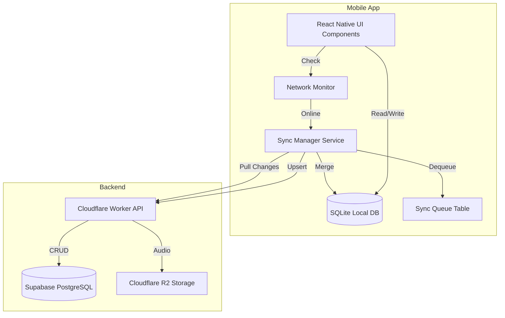

# NoteWave Offline Mode - Complete Architecture Guide

## Overview

NoteWave mobile apps support full offline functionality, allowing users to:
- Record voice notes without internet connection
- Create and manage text notes locally
- View and edit existing notes, tasks, and action items
- Toggle cloud sync on/off per user preference
- Automatic sync when connectivity is restored

This document covers the local database architecture, sync strategy, and conflict resolution for all mobile platforms.

## Architecture Diagram



## Local Database Technology

### Recommended: expo-sqlite

| Factor | Reason |
|--------|--------|
| **Native SQLite** | Real relational database with full SQL support |
| **Expo SDK** | First-class Expo integration, no custom native modules |
| **Cross-Platform** | Same API works on both Android and iOS |
| **Performance** | Native SQLite engine, fast for thousands of notes |
| **Migrations** | Schema versioning support via `expo-sqlite` |

### Alternative: WatermelonDB

For very large datasets (10,000+ notes), consider WatermelonDB which wraps SQLite with a reactive ORM and built-in sync adapters.

## Database Schema

### Table: `notes`

| Column | Type | Constraints | Description |
|--------|------|-------------|-------------|
| `id` | TEXT | PRIMARY KEY | Client-generated UUID (same as web) |
| `userId` | TEXT | NOT NULL | Auth0 sub claim |
| `title` | TEXT | NOT NULL | Note title |
| `transcript` | TEXT | DEFAULT '' | Full transcript |
| `ideaSummary` | TEXT | DEFAULT '' | AI-generated summary |
| `actionItems` | TEXT | DEFAULT '' | Markdown checkboxes |
| `category` | TEXT | DEFAULT 'ideas' | 'ideas' or 'reminders' |
| `ideaName` | TEXT | | Generated catchy name |
| `scheduledDate` | TEXT | | Target date/time |
| `projectStartDate` | TEXT | | Project start date |
| `isComplex` | INTEGER | DEFAULT 0 | Boolean flag |
| `subTodos` | TEXT | DEFAULT '[]' | JSON array of sub-tasks |
| `tags` | TEXT | DEFAULT '[]' | JSON array of tag strings |
| `modelUsed` | TEXT | | AI model identifier |
| `duration` | INTEGER | DEFAULT 0 | Duration in seconds |
| `audioKey` | TEXT | | R2 object key (null if offline) |
| `audioBytes` | INTEGER | DEFAULT 0 | Audio file size |
| `audioLocalPath` | TEXT | | Local filesystem path for offline audio |
| `createdAt` | TEXT | NOT NULL | ISO 8601 timestamp |
| `updatedAt` | TEXT | NOT NULL | Last modification timestamp |
| `syncStatus` | TEXT | DEFAULT 'synced' | 'synced', 'pending', 'conflict', 'local_only' |
| `serverVersion` | INTEGER | DEFAULT 0 | Server-side version counter for conflict detection |
| `localVersion` | INTEGER | DEFAULT 1 | Local version counter |
| `cloudSyncEnabled` | INTEGER | DEFAULT 1 | User preference: 1=sync to cloud, 0=local only |

### Table: `sync_queue`

| Column | Type | Constraints | Description |
|--------|------|-------------|-------------|
| `id` | TEXT | PRIMARY KEY | Queue entry UUID |
| `noteId` | TEXT | NOT NULL | Reference to notes.id |
| `operation` | TEXT | NOT NULL | 'INSERT', 'UPDATE', 'DELETE' |
| `payload` | TEXT | NOT NULL | JSON payload for the operation |
| `createdAt` | TEXT | NOT NULL | When queued |
| `retryCount` | INTEGER | DEFAULT 0 | Failed attempt counter |
| `status` | TEXT | DEFAULT 'pending' | 'pending', 'processing', 'failed', 'completed' |
| `error` | TEXT | | Last error message |

### Table: `user_settings`

| Column | Type | Constraints | Description |
|--------|------|-------------|-------------|
| `key` | TEXT | PRIMARY KEY | Setting key |
| `value` | TEXT | NOT NULL | Setting value |

### Table: `voice_memos`

| Column | Type | Constraints | Description |
|--------|------|-------------|-------------|
| `id` | TEXT | PRIMARY KEY | Memo UUID |
| `userId` | TEXT | NOT NULL | Auth0 sub |
| `localPath` | TEXT | NOT NULL | Local audio file path |
| `duration` | INTEGER | DEFAULT 0 | Duration in seconds |
| `createdAt` | TEXT | NOT NULL | ISO 8601 timestamp |
| `syncStatus` | TEXT | DEFAULT 'pending' | 'synced', 'pending', 'failed' |
| `audioKey` | TEXT | | R2 key after sync |

### Table: `tasks`

| Column | Type | Constraints | Description |
|--------|------|-------------|-------------|
| `id` | TEXT | PRIMARY KEY | Task UUID |
| `noteId` | TEXT | | Parent note reference (nullable for standalone tasks) |
| `text` | TEXT | NOT NULL | Task text |
| `completed` | INTEGER | DEFAULT 0 | Boolean flag |
| `createdAt` | TEXT | NOT NULL | ISO 8601 timestamp |
| `updatedAt` | TEXT | NOT NULL | Last modification |
| `syncStatus` | TEXT | DEFAULT 'synced' | Sync status |
| `serverVersion` | INTEGER | DEFAULT 0 | Server version |

## Sync Strategy

### Sync Modes

| Mode | Description | User Control |
|------|-------------|-------------|
| **Auto Sync** | Automatic sync when online; queue processed in background | Default mode |
| **Manual Sync** | User triggers sync via pull-to-refresh or sync button | Settings option |
| **Offline Only** | All data stays local; no cloud sync attempts | Settings toggle |
| **Cloud Disabled** | User explicitly turned off cloud sync | Settings toggle |

### Sync Flow (Auto Mode)

```mermaid
sequenceDiagram
    participant User
    participant App
    participant LocalDB
    participant SyncManager
    participant API
    participant Cloud

    User->>App: Create note offline
    App->>LocalDB: Insert with syncStatus='pending'
    App->>SyncManager: Add to sync queue
    Note right SyncManager: Waiting for network...
    SyncManager->>SyncManager: Network detected
    SyncManager->>API: POST /api/notes/sync
    API->>Cloud: Upsert notes
    Cloud-->>API: Success
    API-->>SyncManager: {success: true}
    SyncManager->>LocalDB: Update syncStatus='synced'
    SyncManager->>API: GET /api/notes (pull changes)
    API-->>SyncManager: Remote changes
    SyncManager->>LocalDB: Merge remote changes
    SyncManager->>App: Sync complete event
```

### Conflict Resolution Strategy

| Scenario | Resolution |
|----------|-----------|
| **Local modified, server unchanged** | Local wins, push to server |
| **Server modified, local unchanged** | Server wins, pull to local |
| **Both modified (same field)** | Server wins (last-write-wins with server priority) |
| **Both modified (different fields)** | Merge: combine changes from both sides |
| **Local deleted, server modified** | Server wins (restore from cloud) |
| **Both deleted** | Confirmed deletion |
| **User has cloud sync disabled** | Skip sync entirely, keep local only |

### Version-Based Conflict Detection

Each note carries two version counters:
- `serverVersion`: Incremented by backend on each upsert
- `localVersion`: Incremented by app on each local change

When syncing:
1. Send `localVersion` with the upsert request
2. Backend compares with stored `serverVersion`
3. If `localVersion < serverVersion`, conflict detected → return current server state
4. App merges or overwrites based on conflict resolution rules

## Network Connectivity Detection

### Implementation

```typescript
import NetInfo from '@react-native-community/netinfo';

export class NetworkMonitor {
  private subscription: any = null;
  private onConnect?: () => void;
  private onDisconnect?: () => void;

  start(onConnect: () => void, onDisconnect: () => void) {
    this.onConnect = onConnect;
    this.onDisconnect = onDisconnect;

    this.subscription = NetInfo.addEventListener(state => {
      if (state.isConnected && state.isInternetReachable) {
        this.onConnect?.();
      } else {
        this.onDisconnect?.();
      }
    });
  }

  stop() {
    this.subscription?.();
  }

  async isOnline(): Promise<boolean> {
    const state = await NetInfo.fetch();
    return !!(state.isConnected && state.isInternetReachable);
  }
}
```

## Audio File Handling (Offline)

### Local Storage Strategy

| Platform | Storage Location | Library |
|----------|-----------------|---------|
| **Android** | `ApplicationDirectoryPath` via `expo-file-system` | `expo-file-system` |
| **iOS** | `DocumentDirectory` via `expo-file-system` | `expo-file-system` |

### Offline Audio Flow

1. User records voice note → saved to local filesystem as `.m4a` (iOS) or `.aac` (Android)
2. Note created in local DB with `audioLocalPath` pointing to file
3. `audioKey` is NULL (no cloud upload yet)
4. `syncStatus` set to 'pending'
5. When online → upload to R2 via `/api/transcribe` or direct upload
6. On success → `audioKey` populated, `audioLocalPath` can be cleaned up (optional)

### Storage Management

- **Max local audio storage**: 500 MB (configurable)
- **Cleanup strategy**: Delete local audio files after successful cloud sync (if user enables "Save storage space" option)
- **Retention**: Keep failed uploads for 7 days, then auto-delete

## User Settings for Offline Mode

### Settings Keys

| Key | Type | Default | Description |
|-----|------|---------|-------------|
| `cloudSyncEnabled` | boolean | true | Master toggle for cloud sync |
| `autoSyncEnabled` | boolean | true | Auto-sync when online |
| `syncWifiOnly` | boolean | false | Only sync on Wi-Fi |
| `deleteLocalAfterSync` | boolean | false | Delete local audio after cloud sync |
| `offlineMode` | boolean | false | Force offline mode (no sync attempts) |

## Sync Manager Service

### Core Interface

```typescript
interface SyncManager {
  // Initialize sync system
  initialize(): Promise<void>;

  // Push pending changes to cloud
  pushSync(): Promise<SyncResult>;

  // Pull changes from cloud
  pullSync(): Promise<SyncResult>;

  // Full bidirectional sync
  fullSync(): Promise<SyncResult>;

  // Queue a local change for sync
  queueChange(noteId: string, operation: Operation, payload: any): Promise<void>;

  // Check current sync status
  getSyncStatus(): Promise<SyncStatus>;

  // Force offline mode
  setOfflineMode(enabled: boolean): Promise<void>;

  // Get pending queue count
  getPendingCount(): Promise<number>;
}

interface SyncResult {
  success: boolean;
  notesSynced: number;
  conflicts: number;
  errors: SyncError[];
}

interface SyncError {
  noteId: string;
  message: string;
}
```

## Initialization Database Setup

```typescript
import * as SQLite from 'expo-sqlite';

const DB_NAME = 'notewave.db';

export async function initializeDatabase(): Promise<SQLite.SQLiteDatabase> {
  const db = SQLite.openDatabaseSync(DB_NAME);

  // Create tables
  db.execSync(`
    CREATE TABLE IF NOT EXISTS notes (
      id TEXT PRIMARY KEY,
      userId TEXT NOT NULL,
      title TEXT NOT NULL,
      transcript TEXT DEFAULT '',
      ideaSummary TEXT DEFAULT '',
      actionItems TEXT DEFAULT '',
      category TEXT DEFAULT 'ideas',
      ideaName TEXT,
      scheduledDate TEXT,
      projectStartDate TEXT,
      isComplex INTEGER DEFAULT 0,
      subTodos TEXT DEFAULT '[]',
      tags TEXT DEFAULT '[]',
      modelUsed TEXT,
      duration INTEGER DEFAULT 0,
      audioKey TEXT,
      audioBytes INTEGER DEFAULT 0,
      audioLocalPath TEXT,
      createdAt TEXT NOT NULL,
      updatedAt TEXT NOT NULL,
      syncStatus TEXT DEFAULT 'synced',
      serverVersion INTEGER DEFAULT 0,
      localVersion INTEGER DEFAULT 1,
      cloudSyncEnabled INTEGER DEFAULT 1
    );

    CREATE TABLE IF NOT EXISTS sync_queue (
      id TEXT PRIMARY KEY,
      noteId TEXT NOT NULL,
      operation TEXT NOT NULL,
      payload TEXT NOT NULL,
      createdAt TEXT NOT NULL,
      retryCount INTEGER DEFAULT 0,
      status TEXT DEFAULT 'pending',
      error TEXT
    );

    CREATE TABLE IF NOT EXISTS user_settings (
      key TEXT PRIMARY KEY,
      value TEXT NOT NULL
    );

    CREATE TABLE IF NOT EXISTS voice_memos (
      id TEXT PRIMARY KEY,
      userId TEXT NOT NULL,
      localPath TEXT NOT NULL,
      duration INTEGER DEFAULT 0,
      createdAt TEXT NOT NULL,
      syncStatus TEXT DEFAULT 'pending',
      audioKey TEXT
    );

    CREATE TABLE IF NOT EXISTS tasks (
      id TEXT PRIMARY KEY,
      noteId TEXT,
      text TEXT NOT NULL,
      completed INTEGER DEFAULT 0,
      createdAt TEXT NOT NULL,
      updatedAt TEXT NOT NULL,
      syncStatus TEXT DEFAULT 'synced',
      serverVersion INTEGER DEFAULT 0
    );

    CREATE INDEX IF NOT EXISTS idx_notes_sync_status ON notes(syncStatus);
    CREATE INDEX IF NOT EXISTS idx_notes_user ON notes(userId);
    CREATE INDEX IF NOT EXISTS idx_queue_status ON sync_queue(status);
  `);

  return db;
}
```

## Dependencies Required

```bash
# Local database
npx expo install expo-sqlite

# Network monitoring
npm install @react-native-community/netinfo

# File system for audio storage
npx expo install expo-file-system

# Background tasks (optional, for background sync)
npx expo install expo-task-manager expo-background-fetch
```

## Performance Considerations

| Metric | Target |
|--------|--------|
| Local query response | < 50ms for 1,000 notes |
| Sync queue processing | Batch 10 notes per request |
| Audio file upload | Chunked upload for files > 5MB |
| Database size limit | ~100 MB (approx. 5,000 notes with metadata) |
| Local audio storage | ~500 MB (configurable) |

## Security

- **SQLite encryption**: Use `sqlcipher` for encrypted local storage (optional, via community fork)
- **Audio files**: Stored in app-private directory (not accessible to other apps)
- **Biometric lock**: Optional Face ID / Touch ID gate before app access (see biometrics service)
- **Cloud sync disabled**: Data never leaves the device

## Testing Offline Mode

1. Enable Airplane mode on device
2. Record voice note → verify saved locally
3. Create text note → verify saved locally
4. Check sync status indicator shows "Offline"
5. Disable Airplane mode
6. Verify auto-sync triggers
7. Check notes appear on web dashboard
8. Make change on web → verify syncs to mobile


