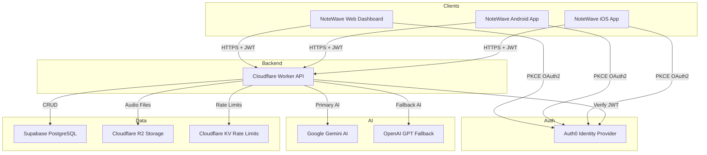

# NoteWave - AI Voice Notes & Tasks

## Project Overview

NoteWave is a full-stack AI-powered voice note application with a web dashboard and native mobile apps. Users record voice notes that are transcribed and analyzed by AI (Gemini/OpenAI) to generate structured notes, action items, and task roadmaps.

### Architecture Overview



## Repository Structure

```
notewave-web/
├── .env.example              # Frontend environment template
├── index.html                # Web app entry HTML
├── package.json              # Dependencies and scripts
├── worker.js                 # ⚡ Backend API (Cloudflare Worker)
├── vite.config.ts            # Vite build configuration
├── tsconfig.json             # TypeScript configuration
├── metadata.json             # Project metadata
├── docs/                     # 📱 Mobile app build recipes
│   ├── BACKEND_API.md        # Complete API documentation
│   ├── ANDROID_APP_RECIPE.md # Android build guide
│   ├── IOS_APP_RECIPE.md     # iOS build guide
│   └── DESIGN_GUIDELINES.md  # Mobile UI design system
└── src/                      # React frontend source
    ├── App.tsx               # Main app component
    ├── main.tsx              # Entry point + Auth0 provider
    ├── config.ts             # API URL + routing config
    ├── authToken.ts          # Auth0 token bridge
    ├── supabase.ts           # API service layer
    ├── types.ts              # TypeScript type definitions
    ├── locale.ts             # Internationalization (7 languages)
    └── components/           # React UI components
        ├── RecordingSlate.tsx      # Voice recording interface
        ├── NotesHistory.tsx        # Notes list with search/filter
        ├── TasksWorkspace.tsx      # Task management view
        ├── AIAgentWorkspace.tsx    # AI chat with RAG
        ├── IdeaGenerator.tsx       # Example prompts
        ├── TextUploadSlate.tsx     # Text document import
        ├── SettingsPanel.tsx       # User settings
        ├── WaveformVisualizer.tsx  # Audio waveform display
        └── NoteWaveLanding.tsx     # Public landing page
```

## Features

| Feature | Description |
|---------|-------------|
| **Voice Recording** | Record voice notes with live waveform visualization |
| **AI Transcription** | Gemini/OpenAI transcribes and structures voice input |
| **Smart Categorization** | AI auto-classifies as Ideas or Reminders |
| **Action Items** | Auto-generated to-do checklists from voice notes |
| **Text Import** | Upload text documents for AI analysis |
| **AI Agent Chat** | Ask questions about your notes using RAG |
| **Cloud Sync** | Notes sync across devices via Supabase |
| **Multi-Language** | UI in 7 languages: EN, ES, FR, DE, CS, SK, JA |
| **Dark Mode** | Light and dark theme with 5 accent colors |
| **Free/Premium Tiers** | Rate-limited free tier, unlimited premium |

## Technology Stack

### Frontend (Web Dashboard)

| Technology | Purpose |
|-----------|---------|
| React 19 | UI Framework |
| TypeScript | Type Safety |
| Vite | Build Tool |
| Tailwind CSS v4 | Styling |
| Auth0 React | Authentication |
| Framer Motion | Animations |
| Lucide React | Icons |

### Backend (Cloudflare Worker)

| Technology | Purpose |
|-----------|---------|
| Cloudflare Workers | Edge API Runtime |
| Auth0 (RS256 JWT) | Authentication |
| Google Gemini | Primary AI (transcription, analysis) |
| OpenAI | Fallback AI (when Gemini is overloaded) |
| Supabase | PostgreSQL Database |
| Cloudflare R2 | Audio Object Storage |
| Cloudflare KV | Rate Limiting |

### Mobile Apps (Planned)

**Primary Stack: TypeScript + React Native + Expo** (90%+ of code is cross-platform)

| Technology | Purpose |
|-----------|---------|
| React Native + Expo | Cross-platform mobile framework |
| TypeScript | Type-safe codebase shared with web |
| auth0-react-native-context | Mobile authentication (PKCE) |
| expo-av | Audio recording |
| expo-sqlite | Local SQLite database (offline-first) |
| @react-navigation | Navigation |
| expo-secure-store | iOS Keychain storage |
| @react-native-community/netinfo | Network connectivity detection |

**Native Modules: Kotlin + Swift** (~10% of code, platform-specific features)

| Feature | Android (Kotlin) | iOS (Swift) |
|---------|-----------------|-------------|
| Home Screen Widget | `AppWidgetProvider` | WidgetKit Extension |
| On-Device AI | ONNX Runtime / MediaPipe | Core ML / MLX |
| Local AI Transcription | MediaPipe Speech | SFSpeechRecognizer |
| Native Bridge | React Native Modules API | Expo Config Plugins |

### Hybrid Architecture

```
┌─────────────────────────────────────────────┐
│  React Native Layer (TypeScript)            │
│  - UI Components, Navigation, Business Logic│
│  - Auth0 Authentication                     │
│  - SQLite Database (offline-first)          │
│  - Sync Manager                             │
├─────────────────────────────────────────────┤
│  Native Bridge (React Native Modules API)   │
├──────────────────┬──────────────────────────┤
│  Android (Kotlin)│     iOS (Swift)          │
│  - Widget        │     - WidgetKit          │
│  - ONNX Runtime  │     - Core ML / MLX      │
│  - MediaPipe     │     - SFSpeechRecognizer │
└──────────────────┴──────────────────────────┘

## Authentication

NoteWave uses **Auth0** for user authentication with PKCE flow (no client secrets).

### Configured Auth0 Applications

| Platform | Type | Client ID |
|----------|------|-----------|
| **Web** | Single Page Application | `mjHg2X98t67ZQwMR5URbkDWQB6niGn7O` |
| **Android** | Native | `MEnHjqTVml8sN8oF6yOLq7NmsO8ua7nn` |
| **iOS** | Native | `sI7yyDSnu5Jrzab6JcXkJzj5zB7YgbVX` |
| **API (Test)** | Machine to Machine | `u1ZgUAKyjSRXqPpnLVLDxsUMbhEYDu9I` |
| **API (Test)** | Machine to Machine | `pbfDEU8qzsNIpaV3U8vcJeNcmZIq4rI` |

### Auth Flow

1. User clicks "Login" → Redirect to Auth0 Universal Login
2. User authenticates (email/password, social login, etc.)
3. Auth0 redirects back with authorization code
4. SDK exchanges code for tokens (PKCE)
5. Access token attached to API requests as Bearer token
6. Backend verifies JWT signature against Auth0 JWKS
7. Tokens auto-refreshed before expiry

## API Endpoints

All endpoints are served by a single Cloudflare Worker at `https://napi.ccma-fetch.space`.

| Method | Endpoint | Auth | Description |
|--------|----------|------|-------------|
| GET | `/api/health` | No | Health check |
| GET | `/api/usage` | Optional | Get usage statistics |
| POST | `/api/transcribe` | Yes | Transcribe voice recording |
| POST | `/api/analyze-text` | Yes | Analyze text document |
| POST | `/api/ai-agent` | Yes | Chat with AI agent (RAG) |
| GET | `/api/notes` | Yes | Get user notes |
| POST | `/api/notes/sync` | Yes | Sync notes to cloud |
| DELETE | `/api/notes/:id` | Yes | Delete single note |
| DELETE | `/api/notes/all` | Yes | Delete all notes |
| GET | `/api/audio?key=...` | Yes | Get audio file |
| POST | `/api/user-settings` | Yes | Save user settings |

See [`docs/BACKEND_API.md`](docs/BACKEND_API.md) for complete API documentation.

## Getting Started (Web)

### Prerequisites

- Node.js 18+
- npm or yarn

### Installation

```bash
# Clone the repository
git clone https://github.com/your-org/notewave-web.git
cd notewave-web

# Install dependencies
npm install

# Create .env file
cp .env.example .env

# Edit .env with your Auth0 credentials
# VITE_AUTH0_DOMAIN=notewave.eu.auth0.com
# VITE_AUTH0_CLIENT_ID=mjHg2X98t67ZQwMR5URbkDWQB6niGn7O

# Start development server
npm run dev
```

### Build for Production

```bash
npm run build
npm run preview
```

## Building Mobile Apps

Complete step-by-step recipes for building native mobile apps:

### Android
See [`docs/ANDROID_APP_RECIPE.md`](docs/ANDROID_APP_RECIPE.md) for:
- Expo + React Native setup
- Auth0 native authentication
- Audio recording implementation
- Android build and deployment

### iOS
See [`docs/IOS_APP_RECIPE.md`](docs/IOS_APP_RECIPE.md) for:
- iOS-specific configurations
- Face ID / Touch ID integration
- iOS audio recording
- App Store submission

### Design
See [`docs/DESIGN_GUIDELINES.md`](docs/DESIGN_GUIDELINES.md) for:
- Color system and typography
- Component specifications
- Screen layouts
- Platform-specific guidelines

## Backend Deployment

The backend is a single Cloudflare Worker. See [`worker.js`](worker.js) for the complete implementation.

### Deployment Steps

1. Create Cloudflare Worker at `napi.ccma-fetch.space`
2. Set environment variables (see [`docs/BACKEND_API.md`](docs/BACKEND_API.md))
3. Bind KV namespace (`RATE_LIMIT`) and R2 bucket (`AUDIO`)
4. Deploy `worker.js`

## Rate Limits

| Plan | AI Requests/Day | Max Notes | Max Audio Storage |
|------|----------------|-----------|-------------------|
| Free | 3 | 10 | 50 MB |
| Premium | 50 | 100 | 1 GB |

## Internationalization

The web dashboard supports 7 languages:

| Code | Language |
|------|----------|
| en | English |
| es | Spanish |
| fr | French |
| de | German |
| cs | Czech |
| sk | Slovak |
| ja | Japanese |

## License

Private - All rights reserved.

## Support

For issues or questions, contact the development team.
